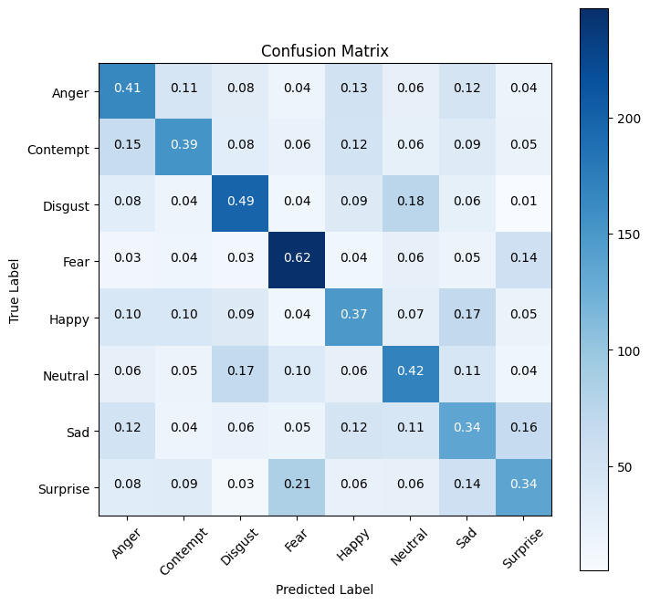
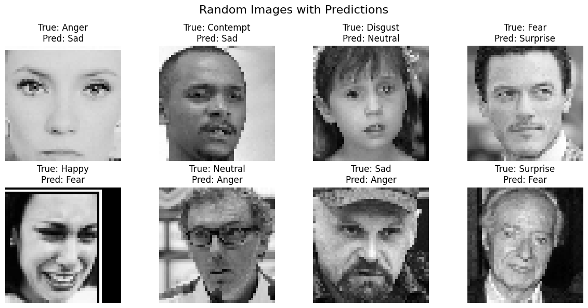

# EmotionScan
Human emotions are often reflected through facial expressions, and detecting these emotions can provide valuable insights into an individual's mood and well-being. However, there is a lack of real-time systems that can not only detect and analyze moods but also offer immediate feedback to counter negative emotions and uplift one's spirits.


```python
import os
import logging
import numpy as np
import tensorflow as tf
from tensorflow.keras import layers, models
from tensorflow.keras.utils import to_categorical
import cv2
from tensorflow.keras.models import load_model
from sklearn.metrics import confusion_matrix, classification_report
import matplotlib.pyplot as plt
```


```python
IMAGE_SIZE = (48, 48, 1)
NUM_CLASSES = 8
BATCH_SIZE = 64
EPOCHS = 50
SAVE_MODEL_PATH = "trained_model"
CLASS_NAMES = ['Anger', 'Contempt', 'Disgust', 'Fear', 'Happy', 'Neutral', 'Sad','Surprise']
```


```python
# Set up logging
logging.basicConfig(level=logging.INFO, format='%(asctime)s - %(levelname)s - %(message)s')
logger = logging.getLogger(__name__)

```


```python
### Step 4: Load and Prepare Data
path = '/prepared_dataset'
# Load Data
logger.info("Loading data...")
train_data = np.load(os.path.join(path, "train_data.npy"))
train_labels = np.load(os.path.join(path, "train_labels.npy"))
val_data = np.load(os.path.join(path, "val_data.npy"))
val_labels = np.load(os.path.join(path, "val_labels.npy"))

# One-hot encode labels
logger.info("One-hot encoding labels...")
train_labels = to_categorical(train_labels, NUM_CLASSES)
val_labels = to_categorical(val_labels, NUM_CLASSES)

logger.info("Data loaded successfully.")
logger.info(f"Training data shape: {train_data.shape}, Training labels shape: {train_labels.shape}")
logger.info(f"Validation data shape: {val_data.shape}, Validation labels shape: {val_labels.shape}")
```

    2024-12-29 21:01:49,498 - INFO - Loading data...
    2024-12-29 21:01:49,633 - INFO - One-hot encoding labels...
    2024-12-29 21:01:49,636 - INFO - Data loaded successfully.
    2024-12-29 21:01:49,636 - INFO - Training data shape: (37553, 48, 48, 1), Training labels shape: (37553, 8)
    2024-12-29 21:01:49,636 - INFO - Validation data shape: (800, 48, 48, 1), Validation labels shape: (800, 8)


```python
### Step 5: Define the Model

def create_ddamfn_model():
    """Define a simplified DDAMFN++ model."""
    logger.info("Creating model architecture...")
    model = models.Sequential([
        layers.Conv2D(64, (3, 3), activation='relu', input_shape=IMAGE_SIZE),
        layers.MaxPooling2D((2, 2)),
        layers.Conv2D(128, (3, 3), activation='relu'),
        layers.MaxPooling2D((2, 2)),
        layers.Conv2D(256, (3, 3), activation='relu'),
        layers.Flatten(),
        layers.Dense(256, activation='relu'),
        layers.Dropout(0.5),
        layers.Dense(NUM_CLASSES, activation='softmax')
    ])
    logger.info("Model architecture created.")
    return model
```


```python
### Step 6: Compile and Train the Model

# Create and Compile Model
logger.info("Initializing and compiling model...")
model = create_ddamfn_model()
model.compile(optimizer='adam', loss='categorical_crossentropy', metrics=['accuracy'])
logger.info("Model compiled successfully.")
```

    2024-12-29 21:01:49,642 - INFO - Initializing and compiling model...
    2024-12-29 21:01:49,642 - INFO - Creating model architecture...
    2024-12-29 21:01:49,780 - INFO - Model architecture created.
    2024-12-29 21:01:49,784 - INFO - Model compiled successfully.


```python
# Train Model
logger.info("Starting model training...")
history = model.fit(
    train_data, train_labels,
    validation_data=(val_data, val_labels),
    batch_size=BATCH_SIZE,
    epochs=EPOCHS
)
logger.info("Model training completed.")

# Save Model
logger.info("Saving trained model...")
os.makedirs(SAVE_MODEL_PATH, exist_ok=True)
model.save(SAVE_MODEL_PATH)
logger.info(f"Model saved successfully at {SAVE_MODEL_PATH}.")
```

    2024-12-29 21:01:49,786 - INFO - Starting model training...


    Epoch 1/50
    587/587 [==============================] - 56s 94ms/step - loss: 1.9798 - accuracy: 0.2139 - val_loss: 1.7748 - val_accuracy: 0.3175
    Epoch 2/50
    587/587 [==============================] - 53s 90ms/step - loss: 1.7565 - accuracy: 0.3312 - val_loss: 1.6143 - val_accuracy: 0.3850
    Epoch 3/50
    587/587 [==============================] - 53s 89ms/step - loss: 1.6504 - accuracy: 0.3712 - val_loss: 1.5531 - val_accuracy: 0.4075
    Epoch 4/50
    587/587 [==============================] - 53s 90ms/step - loss: 1.5762 - accuracy: 0.4038 - val_loss: 1.5139 - val_accuracy: 0.4313
    Epoch 5/50
    587/587 [==============================] - 52s 88ms/step - loss: 1.5320 - accuracy: 0.4246 - val_loss: 1.5040 - val_accuracy: 0.4238
    Epoch 6/50
    587/587 [==============================] - 53s 90ms/step - loss: 1.4827 - accuracy: 0.4446 - val_loss: 1.4763 - val_accuracy: 0.4325
    Epoch 7/50
    587/587 [==============================] - 55s 93ms/step - loss: 1.4400 - accuracy: 0.4626 - val_loss: 1.4798 - val_accuracy: 0.4400
    Epoch 8/50
    587/587 [==============================] - 54s 92ms/step - loss: 1.4023 - accuracy: 0.4735 - val_loss: 1.4924 - val_accuracy: 0.4500
    Epoch 9/50
    587/587 [==============================] - 54s 93ms/step - loss: 1.3660 - accuracy: 0.4868 - val_loss: 1.4831 - val_accuracy: 0.4475
    Epoch 10/50
    587/587 [==============================] - 55s 94ms/step - loss: 1.3218 - accuracy: 0.5055 - val_loss: 1.4852 - val_accuracy: 0.4450
    Epoch 11/50
    587/587 [==============================] - 54s 92ms/step - loss: 1.2844 - accuracy: 0.5185 - val_loss: 1.4942 - val_accuracy: 0.4600
    Epoch 12/50
    587/587 [==============================] - 52s 89ms/step - loss: 1.2414 - accuracy: 0.5322 - val_loss: 1.4974 - val_accuracy: 0.4538
    Epoch 13/50
    587/587 [==============================] - 52s 88ms/step - loss: 1.2061 - accuracy: 0.5446 - val_loss: 1.5027 - val_accuracy: 0.4538
    Epoch 14/50
    587/587 [==============================] - 53s 90ms/step - loss: 1.1655 - accuracy: 0.5573 - val_loss: 1.5988 - val_accuracy: 0.4512
    Epoch 15/50
    587/587 [==============================] - 53s 89ms/step - loss: 1.1258 - accuracy: 0.5737 - val_loss: 1.6303 - val_accuracy: 0.4400
    Epoch 16/50
    587/587 [==============================] - 52s 89ms/step - loss: 1.0897 - accuracy: 0.5796 - val_loss: 1.6258 - val_accuracy: 0.4313
    Epoch 17/50
    587/587 [==============================] - 53s 91ms/step - loss: 1.0466 - accuracy: 0.5989 - val_loss: 1.7006 - val_accuracy: 0.4437
    Epoch 18/50
    587/587 [==============================] - 56s 96ms/step - loss: 1.0070 - accuracy: 0.6140 - val_loss: 1.7216 - val_accuracy: 0.4387
    Epoch 19/50
    587/587 [==============================] - 56s 96ms/step - loss: 0.9782 - accuracy: 0.6207 - val_loss: 1.7947 - val_accuracy: 0.4600
    Epoch 20/50
    587/587 [==============================] - 61s 104ms/step - loss: 0.9371 - accuracy: 0.6380 - val_loss: 1.8764 - val_accuracy: 0.4412
    Epoch 21/50
    587/587 [==============================] - 56s 96ms/step - loss: 0.9153 - accuracy: 0.6445 - val_loss: 1.8715 - val_accuracy: 0.4363
    Epoch 22/50
    587/587 [==============================] - 56s 96ms/step - loss: 0.8782 - accuracy: 0.6587 - val_loss: 1.9770 - val_accuracy: 0.4263
    Epoch 23/50
    587/587 [==============================] - 58s 99ms/step - loss: 0.8484 - accuracy: 0.6697 - val_loss: 2.0329 - val_accuracy: 0.4387
    Epoch 24/50
    587/587 [==============================] - 58s 99ms/step - loss: 0.8140 - accuracy: 0.6801 - val_loss: 2.0590 - val_accuracy: 0.4300
    Epoch 25/50
    587/587 [==============================] - 58s 99ms/step - loss: 0.7841 - accuracy: 0.6917 - val_loss: 2.0496 - val_accuracy: 0.4450
    Epoch 26/50
    587/587 [==============================] - 60s 102ms/step - loss: 0.7589 - accuracy: 0.7025 - val_loss: 2.1645 - val_accuracy: 0.4187
    Epoch 27/50
    587/587 [==============================] - 100s 171ms/step - loss: 0.7417 - accuracy: 0.7067 - val_loss: 2.2670 - val_accuracy: 0.4325
    Epoch 28/50
    587/587 [==============================] - 57s 97ms/step - loss: 0.7209 - accuracy: 0.7156 - val_loss: 2.3052 - val_accuracy: 0.4200
    Epoch 29/50
    587/587 [==============================] - 62s 106ms/step - loss: 0.6987 - accuracy: 0.7234 - val_loss: 2.4627 - val_accuracy: 0.4425
    Epoch 30/50
    587/587 [==============================] - 55s 93ms/step - loss: 0.6741 - accuracy: 0.7332 - val_loss: 2.4912 - val_accuracy: 0.4300
    Epoch 31/50
    587/587 [==============================] - 55s 94ms/step - loss: 0.6588 - accuracy: 0.7375 - val_loss: 2.5991 - val_accuracy: 0.4300
    Epoch 32/50
    587/587 [==============================] - 53s 91ms/step - loss: 0.6477 - accuracy: 0.7424 - val_loss: 2.6693 - val_accuracy: 0.4187
    Epoch 33/50
    587/587 [==============================] - 52s 88ms/step - loss: 0.6224 - accuracy: 0.7490 - val_loss: 2.6121 - val_accuracy: 0.4350
    Epoch 34/50
    587/587 [==============================] - 53s 90ms/step - loss: 0.6070 - accuracy: 0.7570 - val_loss: 2.7668 - val_accuracy: 0.4387
    Epoch 35/50
    587/587 [==============================] - 53s 90ms/step - loss: 0.5900 - accuracy: 0.7623 - val_loss: 2.8877 - val_accuracy: 0.4275
    Epoch 36/50
    587/587 [==============================] - 54s 92ms/step - loss: 0.5807 - accuracy: 0.7678 - val_loss: 2.8534 - val_accuracy: 0.4412
    Epoch 37/50
    587/587 [==============================] - 53s 90ms/step - loss: 0.5730 - accuracy: 0.7700 - val_loss: 2.9317 - val_accuracy: 0.4200
    Epoch 38/50
    587/587 [==============================] - 52s 89ms/step - loss: 0.5603 - accuracy: 0.7728 - val_loss: 2.9753 - val_accuracy: 0.4263
    Epoch 39/50
    587/587 [==============================] - 54s 93ms/step - loss: 0.5468 - accuracy: 0.7783 - val_loss: 3.2088 - val_accuracy: 0.4325
    Epoch 40/50
    587/587 [==============================] - 52s 88ms/step - loss: 0.5397 - accuracy: 0.7824 - val_loss: 3.1244 - val_accuracy: 0.4187
    Epoch 41/50
    587/587 [==============================] - 52s 89ms/step - loss: 0.5393 - accuracy: 0.7812 - val_loss: 3.2224 - val_accuracy: 0.4200
    Epoch 42/50
    587/587 [==============================] - 54s 92ms/step - loss: 0.5186 - accuracy: 0.7922 - val_loss: 3.1858 - val_accuracy: 0.4225
    Epoch 43/50
    587/587 [==============================] - 66s 112ms/step - loss: 0.5231 - accuracy: 0.7901 - val_loss: 3.5243 - val_accuracy: 0.4238
    Epoch 44/50
    587/587 [==============================] - 54s 92ms/step - loss: 0.5076 - accuracy: 0.7944 - val_loss: 3.0412 - val_accuracy: 0.4313
    Epoch 45/50
    587/587 [==============================] - 54s 91ms/step - loss: 0.5019 - accuracy: 0.7968 - val_loss: 3.2580 - val_accuracy: 0.4212
    Epoch 46/50
    587/587 [==============================] - 53s 91ms/step - loss: 0.4828 - accuracy: 0.8024 - val_loss: 3.3787 - val_accuracy: 0.4162
    Epoch 47/50
    587/587 [==============================] - 52s 89ms/step - loss: 0.4801 - accuracy: 0.8054 - val_loss: 3.3691 - val_accuracy: 0.4263
    Epoch 48/50
    587/587 [==============================] - 57s 97ms/step - loss: 0.4833 - accuracy: 0.8037 - val_loss: 3.5021 - val_accuracy: 0.4187
    Epoch 49/50
    587/587 [==============================] - 56s 95ms/step - loss: 0.4704 - accuracy: 0.8087 - val_loss: 3.6376 - val_accuracy: 0.4162
    Epoch 50/50
    587/587 [==============================] - 56s 95ms/step - loss: 0.4682 - accuracy: 0.8090 - val_loss: 3.6441 - val_accuracy: 0.4137


    2024-12-29 21:48:13,818 - INFO - Model training completed.
    2024-12-29 21:48:13,824 - INFO - Saving trained model...


    INFO:tensorflow:Assets written to: trained_model/assets


    2024-12-29 21:48:14,520 - INFO - Assets written to: trained_model/assets
    2024-12-29 21:48:14,555 - INFO - Model saved successfully at trained_model.


```python
### Step 7: Load the Model and Predict on a Single Image

# Load the trained model
print("Loading the trained model...")
model = load_model(SAVE_MODEL_PATH)
print("Model loaded successfully.")

```

    Loading the trained model...
    Model loaded successfully.


```python
def predict_emotion(image_path):
    """
    Predict the emotion from the given image path.
    
    :param image_path: Path to the image file.
    :return: Predicted emotion label.
    """
    if not os.path.exists(image_path):
        raise FileNotFoundError(f"Image file not found: {image_path}")
    
    # Read and preprocess the image
    print(f"Processing image: {image_path}")
    image = cv2.imread(image_path, cv2.IMREAD_GRAYSCALE)
    if image is None:
        raise ValueError("Error reading the image. Please check the file format or path.")
    
    image = cv2.resize(image, IMAGE_SIZE[:2])  # Resize to 48x48
    image = image / 255.0  # Normalize pixel values
    image = np.expand_dims(image, axis=(0, -1))  # Add batch and channel dimensions
    
    # Predict
    predictions = model.predict(image)
    predicted_class = CLASS_NAMES[np.argmax(predictions)]
    return predicted_class
```


```python
# Provide the image path

image_path = '/Notebook/testimage.jpg' #os.path.join(path, "testimage.jpg")  # Replace with your image path
```


```python
try:
    emotion = predict_emotion(image_path)
    print(f"The predicted emotion is: {emotion}")
except Exception as e:
    print(f"Error: {e}")
```

    Processing image: /Notebook/testimage.jpg
    1/1 [==============================] - 0s 47ms/step
    The predicted emotion is: Disgust


```python
### Step 8: Evaluate Model Performance

test_data = np.load(os.path.join(path, "test_data.npy"))
test_labels = np.load(os.path.join(path, "test_labels.npy"))
logger.info(f"Test data shape: {test_data.shape}, Test labels shape: {test_labels.shape}")

```

    2024-12-29 21:48:14,885 - INFO - Test data shape: (3200, 48, 48, 1), Test labels shape: (3200,)


```python
# Predict on Test Data
logger.info("Evaluating model on test data...")
test_predictions = model.predict(test_data)
test_pred_classes = np.argmax(test_predictions, axis=1)
test_true_classes = np.argmax(to_categorical(test_labels, NUM_CLASSES), axis=1)
```

    2024-12-29 21:48:14,891 - INFO - Evaluating model on test data...


    100/100 [==============================] - 2s 16ms/step


```python
# Confusion Matrix
conf_matrix = confusion_matrix(test_true_classes, test_pred_classes)
print("Confusion Matrix:")
print(conf_matrix)
```

    Confusion Matrix:
    [[165  45  32  17  52  24  47  18]
     [ 62 154  31  22  50  25  35  21]
     [ 31  17 198  14  36  74  25   5]
     [ 13  16  11 247  14  24  19  56]
     [ 42  42  36  14 149  28  68  21]
     [ 24  19  67  38  24 170  43  15]
     [ 50  17  22  20  48  43 135  65]
     [ 33  34  10  84  23  24  56 136]]


```python
# Classification Report
class_report = classification_report(test_true_classes, test_pred_classes, target_names=CLASS_NAMES)
print("Classification Report:")
print(class_report)


```

    Classification Report:
                  precision    recall  f1-score   support
    
           Anger       0.39      0.41      0.40       400
        Contempt       0.45      0.39      0.41       400
         Disgust       0.49      0.49      0.49       400
            Fear       0.54      0.62      0.58       400
           Happy       0.38      0.37      0.37       400
         Neutral       0.41      0.42      0.42       400
             Sad       0.32      0.34      0.33       400
        Surprise       0.40      0.34      0.37       400
    
        accuracy                           0.42      3200
       macro avg       0.42      0.42      0.42      3200
    weighted avg       0.42      0.42      0.42      3200
    


```python
# Plot Confusion Matrix
plt.figure(figsize=(8, 8))
plt.imshow(conf_matrix, interpolation='nearest', cmap=plt.cm.Blues)
plt.title("Confusion Matrix")
plt.colorbar()
tick_marks = np.arange(len(CLASS_NAMES))
plt.xticks(tick_marks, CLASS_NAMES, rotation=45)
plt.yticks(tick_marks, CLASS_NAMES)

# Add text annotations
for i in range(conf_matrix.shape[0]):
    for j in range(conf_matrix.shape[1]):
        plt.text(j, i, str(conf_matrix[i, j]),
                 horizontalalignment="center",
                 color="white" if conf_matrix[i, j] > conf_matrix.max() / 2. else "black")

plt.ylabel("True Label")
plt.xlabel("Predicted Label")
plt.show()
```


    

    


```python
# Plot Confusion Matrix
plt.figure(figsize=(8, 8))
plt.imshow(conf_matrix, interpolation='nearest', cmap=plt.cm.Blues)
plt.title("Confusion Matrix")
plt.colorbar()
tick_marks = np.arange(len(CLASS_NAMES))
plt.xticks(tick_marks, CLASS_NAMES, rotation=45)
plt.yticks(tick_marks, CLASS_NAMES)

# Add text annotations
for i in range(conf_matrix.shape[0]):
    for j in range(conf_matrix.shape[1]):
        accuracy = conf_matrix[i, j] / np.sum(conf_matrix[i])
        plt.text(j, i, f"{accuracy:.2f}",
                 horizontalalignment="center",
                 color="white" if conf_matrix[i, j] > conf_matrix.max() / 2. else "black")

plt.ylabel("True Label")
plt.xlabel("Predicted Label")
plt.show()
```


    

    


```python
# Display random images from each class along with predictions
def display_random_images_with_predictions():
    fig, axes = plt.subplots(2, 4, figsize=(12, 6))
    fig.suptitle("Random Images with Predictions", fontsize=16)
    
    for i, class_name in enumerate(CLASS_NAMES):
        class_indices = np.where(test_true_classes == i)[0]
        random_index = np.random.choice(class_indices)
        image = test_data[random_index]
        true_label = CLASS_NAMES[test_true_classes[random_index]]

        # Predict
        predictions = model.predict(image)
        pred_label = CLASS_NAMES[np.argmax(predictions)]
        
        
        
        ax = axes[i // 4, i % 4]
        ax.imshow(image.squeeze(), cmap='gray')
        ax.set_title(f"True: {true_label}\nPred: {pred_label}")
        ax.axis('off')

    plt.tight_layout()
    plt.subplots_adjust(top=0.85)
    plt.show()
```


```python
#display_random_images_with_predictions()
```


```python
def create_ddamfn_plus_model(input_shape=(48, 48, 1), num_classes=8):
    """
    Creates an improved DDAMFN++ model for emotion recognition.
    
    :param input_shape: Tuple representing the input shape of the images.
    :param num_classes: Number of emotion classes.
    :return: Compiled DDAMFN++ model.
    """
    inputs = tf.keras.Input(shape=input_shape)

    # Block 1: Convolution + BatchNorm + Activation + MaxPooling
    x = layers.Conv2D(64, (3, 3), padding="same")(inputs)
    x = layers.BatchNormalization()(x)
    x = layers.ReLU()(x)
    x = layers.MaxPooling2D((2, 2))(x)
    
    # Block 2: Residual Block with Attention
    residual = layers.Conv2D(128, (1, 1), padding="same")(x)
    x = layers.Conv2D(128, (3, 3), padding="same")(x)
    x = layers.BatchNormalization()(x)
    x = layers.ReLU()(x)
    x = layers.Conv2D(128, (3, 3), padding="same")(x)
    x = layers.BatchNormalization()(x)
    x = layers.add([x, residual])  # Residual connection
    x = layers.ReLU()(x)
    x = layers.GlobalAveragePooling2D()(x)  # Attention mechanism
    x = layers.Reshape((1, 1, 128))(x)
    attention = layers.Conv2D(128, (1, 1), activation="sigmoid")(x)
    x = layers.multiply([attention, x])  # Apply attention
    
    # Block 3: Convolutional Block with Dropout
    x = layers.Flatten()(x)
    x = layers.Dense(256, activation="relu")(x)
    x = layers.Dropout(0.5)(x)

    # Output Layer
    outputs = layers.Dense(num_classes, activation="softmax")(x)

    # Create and compile the model
    model = models.Model(inputs, outputs, name="DDAMFN++")
    model.compile(optimizer="adam", loss="categorical_crossentropy", metrics=["accuracy"])
    return model
```


```python
# Create and Compile Model
logger.info("Initializing and compiling model...")
model = create_ddamfn_model()
model.compile(optimizer='adam', loss='categorical_crossentropy', metrics=['accuracy'])
logger.info("Model compiled successfully.")

# Train Model
logger.info("Starting model training...")
history = model.fit(
    train_data, train_labels,
    validation_data=(val_data, val_labels),
    batch_size=BATCH_SIZE,
    epochs=EPOCHS
)
logger.info("Model training completed.")

SAVE_DDAMFN_PLUS_MODEL_PATH = "trained_ddamfn_plus_model"

# Save Model
logger.info("Saving trained model...")
os.makedirs(SAVE_DDAMFN_PLUS_MODEL_PATH, exist_ok=True)
model.save(SAVE_DDAMFN_PLUS_MODEL_PATH)
logger.info(f"Model saved successfully at {SAVE_DDAMFN_PLUS_MODEL_PATH}.")
```

    2024-12-29 21:48:17,071 - INFO - Initializing and compiling model...
    2024-12-29 21:48:17,072 - INFO - Creating model architecture...
    2024-12-29 21:48:17,107 - INFO - Model architecture created.
    2024-12-29 21:48:17,109 - INFO - Model compiled successfully.
    2024-12-29 21:48:17,110 - INFO - Starting model training...


    Epoch 1/50
    587/587 [==============================] - 57s 96ms/step - loss: 1.9532 - accuracy: 0.2297 - val_loss: 1.7230 - val_accuracy: 0.3413
    Epoch 2/50
    587/587 [==============================] - 59s 100ms/step - loss: 1.7298 - accuracy: 0.3405 - val_loss: 1.5886 - val_accuracy: 0.3925
    Epoch 3/50
    587/587 [==============================] - 55s 94ms/step - loss: 1.6255 - accuracy: 0.3851 - val_loss: 1.5454 - val_accuracy: 0.4125
    Epoch 4/50
    587/587 [==============================] - 60s 102ms/step - loss: 1.5559 - accuracy: 0.4162 - val_loss: 1.5153 - val_accuracy: 0.4350
    Epoch 5/50
    587/587 [==============================] - 58s 98ms/step - loss: 1.5006 - accuracy: 0.4336 - val_loss: 1.5057 - val_accuracy: 0.4263
    Epoch 6/50
    587/587 [==============================] - 55s 94ms/step - loss: 1.4491 - accuracy: 0.4565 - val_loss: 1.4927 - val_accuracy: 0.4425
    Epoch 7/50
    587/587 [==============================] - 56s 96ms/step - loss: 1.3938 - accuracy: 0.4780 - val_loss: 1.4878 - val_accuracy: 0.4500
    Epoch 8/50
    587/587 [==============================] - 57s 96ms/step - loss: 1.3449 - accuracy: 0.4947 - val_loss: 1.4916 - val_accuracy: 0.4588
    Epoch 9/50
    587/587 [==============================] - 57s 97ms/step - loss: 1.2945 - accuracy: 0.5133 - val_loss: 1.5178 - val_accuracy: 0.4487
    Epoch 10/50
    587/587 [==============================] - 55s 93ms/step - loss: 1.2445 - accuracy: 0.5312 - val_loss: 1.5284 - val_accuracy: 0.4538
    Epoch 11/50
    587/587 [==============================] - 53s 91ms/step - loss: 1.1945 - accuracy: 0.5508 - val_loss: 1.5667 - val_accuracy: 0.4375
    Epoch 12/50
    587/587 [==============================] - 54s 91ms/step - loss: 1.1496 - accuracy: 0.5682 - val_loss: 1.5553 - val_accuracy: 0.4387
    Epoch 13/50
    587/587 [==============================] - 53s 91ms/step - loss: 1.0949 - accuracy: 0.5851 - val_loss: 1.5987 - val_accuracy: 0.4450
    Epoch 14/50
    587/587 [==============================] - 52s 89ms/step - loss: 1.0398 - accuracy: 0.6074 - val_loss: 1.6811 - val_accuracy: 0.4500
    Epoch 15/50
    587/587 [==============================] - 54s 93ms/step - loss: 0.9942 - accuracy: 0.6214 - val_loss: 1.7197 - val_accuracy: 0.4437
    Epoch 16/50
    587/587 [==============================] - 55s 94ms/step - loss: 0.9484 - accuracy: 0.6366 - val_loss: 1.7987 - val_accuracy: 0.4425
    Epoch 17/50
    587/587 [==============================] - 55s 94ms/step - loss: 0.9096 - accuracy: 0.6532 - val_loss: 1.8313 - val_accuracy: 0.4375
    Epoch 18/50
    587/587 [==============================] - 54s 91ms/step - loss: 0.8663 - accuracy: 0.6669 - val_loss: 1.9593 - val_accuracy: 0.4400
    Epoch 19/50
    587/587 [==============================] - 53s 90ms/step - loss: 0.8213 - accuracy: 0.6824 - val_loss: 1.9574 - val_accuracy: 0.4487
    Epoch 20/50
    587/587 [==============================] - 53s 89ms/step - loss: 0.7962 - accuracy: 0.6904 - val_loss: 2.1052 - val_accuracy: 0.4250
    Epoch 21/50
    587/587 [==============================] - 52s 89ms/step - loss: 0.7567 - accuracy: 0.7032 - val_loss: 2.1187 - val_accuracy: 0.4250
    Epoch 22/50
    587/587 [==============================] - 53s 91ms/step - loss: 0.7252 - accuracy: 0.7136 - val_loss: 2.3072 - val_accuracy: 0.4250
    Epoch 23/50
    587/587 [==============================] - 52s 89ms/step - loss: 0.6979 - accuracy: 0.7240 - val_loss: 2.2665 - val_accuracy: 0.4225
    Epoch 24/50
    587/587 [==============================] - 52s 89ms/step - loss: 0.6859 - accuracy: 0.7299 - val_loss: 2.3242 - val_accuracy: 0.4325
    Epoch 25/50
    587/587 [==============================] - 54s 93ms/step - loss: 0.6566 - accuracy: 0.7395 - val_loss: 2.5280 - val_accuracy: 0.4338
    Epoch 26/50
    587/587 [==============================] - 56s 95ms/step - loss: 0.6328 - accuracy: 0.7490 - val_loss: 2.4515 - val_accuracy: 0.4175
    Epoch 27/50
    587/587 [==============================] - 54s 92ms/step - loss: 0.6128 - accuracy: 0.7575 - val_loss: 2.6987 - val_accuracy: 0.4225
    Epoch 28/50
    587/587 [==============================] - 56s 95ms/step - loss: 0.5992 - accuracy: 0.7617 - val_loss: 2.6735 - val_accuracy: 0.4387
    Epoch 29/50
    587/587 [==============================] - 54s 92ms/step - loss: 0.5772 - accuracy: 0.7693 - val_loss: 2.7530 - val_accuracy: 0.4112
    Epoch 30/50
    587/587 [==============================] - 54s 93ms/step - loss: 0.5664 - accuracy: 0.7722 - val_loss: 2.7256 - val_accuracy: 0.4187
    Epoch 31/50
    587/587 [==============================] - 53s 90ms/step - loss: 0.5551 - accuracy: 0.7765 - val_loss: 2.9058 - val_accuracy: 0.4150
    Epoch 32/50
    587/587 [==============================] - 53s 90ms/step - loss: 0.5399 - accuracy: 0.7823 - val_loss: 2.8753 - val_accuracy: 0.4200
    Epoch 33/50
    587/587 [==============================] - 53s 91ms/step - loss: 0.5268 - accuracy: 0.7877 - val_loss: 3.0313 - val_accuracy: 0.4225
    Epoch 34/50
    587/587 [==============================] - 54s 91ms/step - loss: 0.5211 - accuracy: 0.7919 - val_loss: 3.0334 - val_accuracy: 0.4075
    Epoch 35/50
    587/587 [==============================] - 53s 90ms/step - loss: 0.5029 - accuracy: 0.7979 - val_loss: 3.1526 - val_accuracy: 0.4150
    Epoch 36/50
    587/587 [==============================] - 52s 89ms/step - loss: 0.4960 - accuracy: 0.8003 - val_loss: 3.2702 - val_accuracy: 0.4300
    Epoch 37/50
    587/587 [==============================] - 58s 99ms/step - loss: 0.4842 - accuracy: 0.8048 - val_loss: 3.3756 - val_accuracy: 0.4212
    Epoch 38/50
    587/587 [==============================] - 59s 101ms/step - loss: 0.4804 - accuracy: 0.8028 - val_loss: 3.3252 - val_accuracy: 0.4250
    Epoch 39/50
    587/587 [==============================] - 55s 93ms/step - loss: 0.4652 - accuracy: 0.8093 - val_loss: 3.4566 - val_accuracy: 0.4225
    Epoch 40/50
    587/587 [==============================] - 53s 91ms/step - loss: 0.4609 - accuracy: 0.8110 - val_loss: 3.4072 - val_accuracy: 0.4387
    Epoch 41/50
    587/587 [==============================] - 53s 90ms/step - loss: 0.4620 - accuracy: 0.8128 - val_loss: 3.4305 - val_accuracy: 0.4175
    Epoch 42/50
    587/587 [==============================] - 53s 90ms/step - loss: 0.4514 - accuracy: 0.8197 - val_loss: 3.5621 - val_accuracy: 0.4387
    Epoch 43/50
    587/587 [==============================] - 53s 91ms/step - loss: 0.4382 - accuracy: 0.8227 - val_loss: 3.7603 - val_accuracy: 0.4437
    Epoch 44/50
    587/587 [==============================] - 54s 92ms/step - loss: 0.4313 - accuracy: 0.8227 - val_loss: 3.6328 - val_accuracy: 0.4538
    Epoch 45/50
    587/587 [==============================] - 55s 94ms/step - loss: 0.4357 - accuracy: 0.8219 - val_loss: 3.7252 - val_accuracy: 0.4375
    Epoch 46/50
    587/587 [==============================] - 52s 89ms/step - loss: 0.4308 - accuracy: 0.8249 - val_loss: 3.6994 - val_accuracy: 0.4288
    Epoch 47/50
    587/587 [==============================] - 51s 86ms/step - loss: 0.4185 - accuracy: 0.8282 - val_loss: 3.7628 - val_accuracy: 0.4238
    Epoch 48/50
    587/587 [==============================] - 51s 87ms/step - loss: 0.4078 - accuracy: 0.8341 - val_loss: 3.8887 - val_accuracy: 0.4175
    Epoch 49/50
    587/587 [==============================] - 51s 87ms/step - loss: 0.4066 - accuracy: 0.8349 - val_loss: 3.7358 - val_accuracy: 0.4238
    Epoch 50/50
    587/587 [==============================] - 53s 90ms/step - loss: 0.4012 - accuracy: 0.8366 - val_loss: 4.0296 - val_accuracy: 0.4263


    2024-12-29 22:33:30,828 - INFO - Model training completed.
    2024-12-29 22:33:30,835 - INFO - Saving trained model...


    INFO:tensorflow:Assets written to: trained_ddamfn_plus_model/assets


    2024-12-29 22:33:31,284 - INFO - Assets written to: trained_ddamfn_plus_model/assets
    2024-12-29 22:33:31,310 - INFO - Model saved successfully at trained_ddamfn_plus_model.


```python
### Step 7: Load the Model and Predict on a Single Image

# Load the trained model
print("Loading the trained model...")
ddamfn_plus_model = load_model(SAVE_DDAMFN_PLUS_MODEL_PATH)
print("Model loaded successfully.")
```

    Loading the trained model...
    Model loaded successfully.


```python
def predict_emotion(image_path):
    """
    Predict the emotion from the given image path.
    
    :param image_path: Path to the image file.
    :return: Predicted emotion label.
    """
    if not os.path.exists(image_path):
        raise FileNotFoundError(f"Image file not found: {image_path}")
    
    # Read and preprocess the image
    print(f"Processing image: {image_path}")
    image = cv2.imread(image_path, cv2.IMREAD_GRAYSCALE)
    if image is None:
        raise ValueError("Error reading the image. Please check the file format or path.")
    
    image = cv2.resize(image, IMAGE_SIZE[:2])  # Resize to 48x48
    image = image / 255.0  # Normalize pixel values
    image = np.expand_dims(image, axis=(0, -1))  # Add batch and channel dimensions
    
    # Predict
    predictions = ddamfn_plus_model.predict(image)
    predicted_class = CLASS_NAMES[np.argmax(predictions)]
    return predicted_class
```


```python
try:
    emotion = predict_emotion(image_path)
    print(f"The predicted emotion is: {emotion}")
except Exception as e:
    print(f"Error: {e}")
```

    Processing image: /Notebook/testimage.jpg
    1/1 [==============================] - 0s 32ms/step
    The predicted emotion is: Disgust


```python
### Step 8: Evaluate Model Performance

test_data = np.load(os.path.join(path, "test_data.npy"))
test_labels = np.load(os.path.join(path, "test_labels.npy"))
logger.info(f"Test data shape: {test_data.shape}, Test labels shape: {test_labels.shape}")

# Predict on Test Data
logger.info("Evaluating model on test data...")
ddamfn_plus_test_predictions = ddamfn_plus_model.predict(test_data)
ddamfn_plus_test_pred_classes = np.argmax(test_predictions, axis=1)
ddamfn_plus_test_true_classes = np.argmax(to_categorical(test_labels, NUM_CLASSES), axis=1)

```

    2024-12-29 22:59:48,423 - INFO - Test data shape: (3200, 48, 48, 1), Test labels shape: (3200,)
    2024-12-29 22:59:48,426 - INFO - Evaluating model on test data...


    100/100 [==============================] - 1s 13ms/step


```python
# Confusion Matrix
ddamfn_plus_conf_matrix = confusion_matrix(ddamfn_plus_test_true_classes, ddamfn_plus_test_pred_classes)
print("Confusion Matrix:")
print(ddamfn_plus_conf_matrix)
```

    Confusion Matrix:
    [[165  45  32  17  52  24  47  18]
     [ 62 154  31  22  50  25  35  21]
     [ 31  17 198  14  36  74  25   5]
     [ 13  16  11 247  14  24  19  56]
     [ 42  42  36  14 149  28  68  21]
     [ 24  19  67  38  24 170  43  15]
     [ 50  17  22  20  48  43 135  65]
     [ 33  34  10  84  23  24  56 136]]


```python
# Classification Report
ddamfn_plus_class_report = classification_report(ddamfn_plus_test_true_classes, ddamfn_plus_test_pred_classes, target_names=CLASS_NAMES)
print("Classification Report:")
print(ddamfn_plus_class_report)
```

    Classification Report:
                  precision    recall  f1-score   support
    
           Anger       0.39      0.41      0.40       400
        Contempt       0.45      0.39      0.41       400
         Disgust       0.49      0.49      0.49       400
            Fear       0.54      0.62      0.58       400
           Happy       0.38      0.37      0.37       400
         Neutral       0.41      0.42      0.42       400
             Sad       0.32      0.34      0.33       400
        Surprise       0.40      0.34      0.37       400
    
        accuracy                           0.42      3200
       macro avg       0.42      0.42      0.42      3200
    weighted avg       0.42      0.42      0.42      3200
    


```python
# Plot Confusion Matrix
plt.figure(figsize=(8, 8))
plt.imshow(ddamfn_plus_conf_matrix, interpolation='nearest', cmap=plt.cm.Blues)
plt.title("Confusion Matrix")
plt.colorbar()
tick_marks = np.arange(len(CLASS_NAMES))
plt.xticks(tick_marks, CLASS_NAMES, rotation=45)
plt.yticks(tick_marks, CLASS_NAMES)

# Add text annotations
for i in range(ddamfn_plus_conf_matrix.shape[0]):
    for j in range(ddamfn_plus_conf_matrix.shape[1]):
        plt.text(j, i, str(ddamfn_plus_conf_matrix[i, j]),
                 horizontalalignment="center",
                 color="white" if ddamfn_plus_conf_matrix[i, j] > ddamfn_plus_conf_matrix.max() / 2. else "black")

plt.ylabel("True Label")
plt.xlabel("Predicted Label")
plt.show()
```


    

    


```python
# Plot Confusion Matrix
plt.figure(figsize=(8, 8))
plt.imshow(ddamfn_plus_conf_matrix, interpolation='nearest', cmap=plt.cm.Blues)
plt.title("Confusion Matrix")
plt.colorbar()
tick_marks = np.arange(len(CLASS_NAMES))
plt.xticks(tick_marks, CLASS_NAMES, rotation=45)
plt.yticks(tick_marks, CLASS_NAMES)

# Add text annotations
for i in range(ddamfn_plus_conf_matrix.shape[0]):
    for j in range(ddamfn_plus_conf_matrix.shape[1]):
        accuracy = ddamfn_plus_conf_matrix[i, j] / np.sum(ddamfn_plus_conf_matrix[i])
        plt.text(j, i, f"{accuracy:.2f}",
                 horizontalalignment="center",
                 color="white" if ddamfn_plus_conf_matrix[i, j] > ddamfn_plus_conf_matrix.max() / 2. else "black")

plt.ylabel("True Label")
plt.xlabel("Predicted Label")
plt.show()
```


    

    


```python
# Display random images from each class along with predictions
def display_random_images_with_predictions():
    fig, axes = plt.subplots(2, 4, figsize=(12, 6))
    fig.suptitle("Random Images with Predictions", fontsize=16)
    
    for i, class_name in enumerate(CLASS_NAMES):
        class_indices = np.where(test_true_classes == i)[0]
        random_index = np.random.choice(class_indices)
        image = test_data[random_index]
        true_label = CLASS_NAMES[test_true_classes[random_index]]
        pred_label = CLASS_NAMES[test_pred_classes[random_index]]
        
        ax = axes[i // 4, i % 4]
        ax.imshow(image.squeeze(), cmap='gray')
        ax.set_title(f"True: {true_label}\nPred: {pred_label}")
        ax.axis('off')

    plt.tight_layout()
    plt.subplots_adjust(top=0.85)
    plt.show()
```


```python
display_random_images_with_predictions()
```


    

    


```python

```

